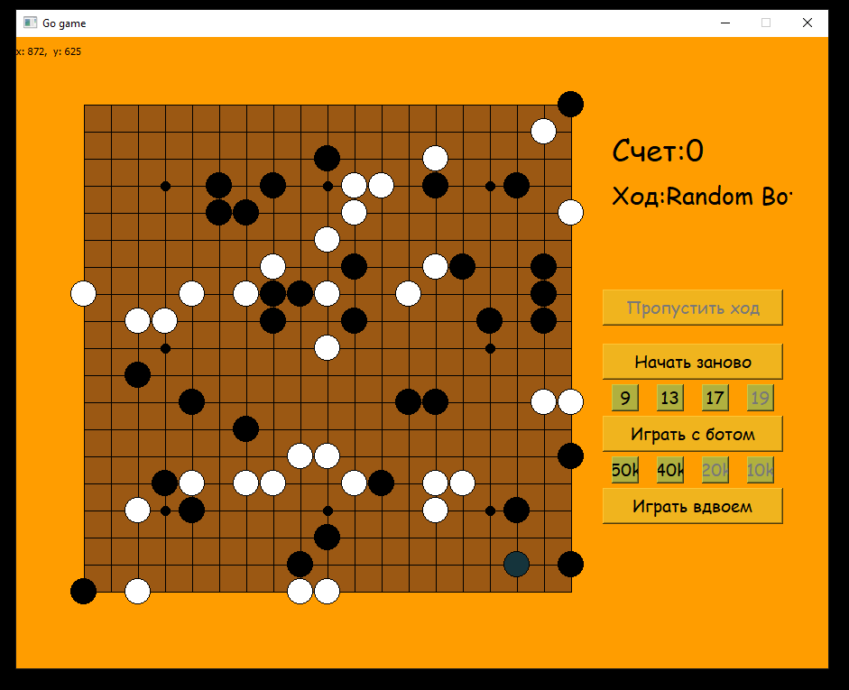

# GoGame

## Описание

[Го](https://en.wikipedia.org/wiki/Go_(game)) - настольная игра для двух игроков, основная цель которой захват вражеской территории. Есть режим игры с ботом двух уровней (ходят практически случайно) - помечены как _50k_ и _40k_ (в реальной системе рангов таких рангов не существует). Размеры карты: _9х9_, _13х13_, _17х17_, _19х19_.

Зависимости:

    py -m pip install -r requirements.txt

Запуск:

    py go_main.py 
  